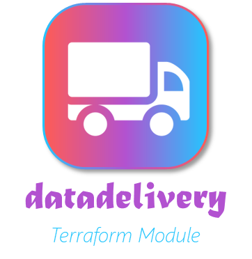
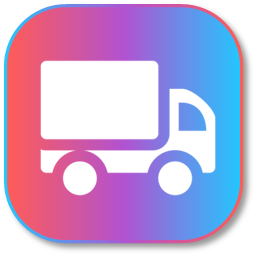
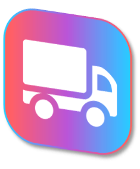

# Design Visual

Primeiramente, é importante citar que todos os insumos relacionados ao *design* do módulo `datadelivery` **não foram feitos por um designer!** 😅

Com essa premissa estabelecida, esta seção tem o propósito nobre de referenciar todas as fontes, ferramentas e sites utilizados no processo artístico de criação de todos os elementos visuais contemplados na biblioteca.

## Logo

O logo do módulo traz uma visão de *delivery*, representada por um veículo de carga.

| **Imagem com logo e nome** | **Imagem apenas com logo** | **Imagem com logo rotacionado** | 
| :--: | :--: | :--: |
| { width=250 height=250 } | { width=200 height=200 } | { width=180 height=180 } |

Referências visuais para construção do logo:

- [slidesgo - Fruit Brand Style Technology Products](https://slidesgo.com/pt/tema/pitch-deck-para-produtos-de-tecnologia-com-estilo-marca-de-frutas)
- [flaticon - van_2787368 from Prosymbols Premium](https://www.flaticon.com/free-icon/van_2787368)

A imagem na [home](../index.md) da documentação foi criada utilizando a ilustração [Heavy Box Cartoon Illustrations](https://storyset.com/illustration/heavy-box/bro) da página [storyset](https://storyset.com/).

???+ tip "Sobre a conversão das imagens para a geração de ícones customizados"
    Para conseguir gerar os logos customizados no cabeçalho da página, foi preciso realizar algumas etapas:

    1. Converter a imagem PNG em um formato ICO utilizando as dimensões 32x32px ([cloudconvert](https://cloudconvert.com/png-to-ico))
    2. Converter o arquivo ICO gerado para o formato SVG mantendo os *presets* de cores ([pixelied](https://pixelied.com/convert/png-converter/png-to-svg))

## Fontes

- [Matura MT Script Capitals](https://www.cdnfonts.com/matura-mt-script-capitals.font) para o título (datadelivery)
- [Segoe UI Light](https://www.fonts100.com/font+89949_Segoe+UI+Light.html) para o substítulo (terraform module)

## Cores

- Cereja Ardente (`#FF5C55`)
- Azul Céu Claro (`#5CB8E4`)
- Lavanda Profunda (`#B252D0`)
- Branco (`#FFFFFF`)

??? question "De onde vieram esses nomes para as cores?"
    É meus amigos, nada como uma boa inteligência artificial generativa como o [ChatGPT](https://chat.openai.com/) para nos ajudar nas tarefas criativas. Sim, a curiosidade me fez criar um prompt para nosso amigo GPT fornecer nomes para cores com base em seus códigos hexadecimais.

    *Diálogo com a IA:*
    
    >👨‍🦲: Você é um agente especializado em fornecer nomes para cores utilizando, como insumo, seu código hexadecimal. Utilize referências sensoriais e forneça um nome curto para a cor com base em seu código HEX.

    > Dito isso, forneça um nome para a seguinte cor:

    > ```
    > #FF5C55
    > ```

    ___

    > 🤖: Com base no código hexadecimal #FF5C55, eu nomearia essa cor como "Cereja Ardente".


## Ferramentas de Criação

- [Flaticon](https://www.flaticon.com/)
- [Dafont.com](https://www.dafont.com/)
- [slidesgo](https://slidesgo.com/pt/)
- [storyset](https://storyset.com/)
- [Power Point](https://www.microsoft.com/en-us/microsoft-365/powerpoint)
- [cloudconvert](https://cloudconvert.com/png-to-ico)
- [pixelied](https://pixelied.com/convert/png-converter/png-to-svg)